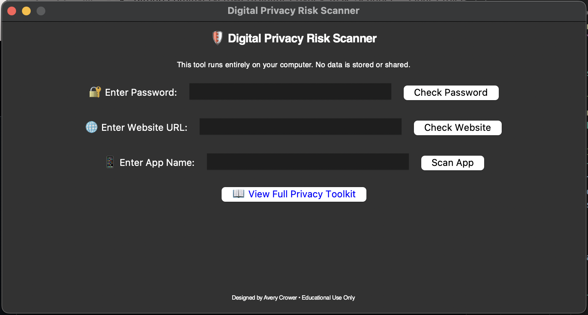
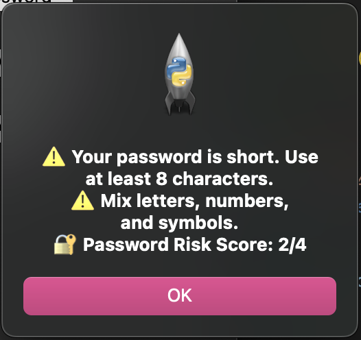
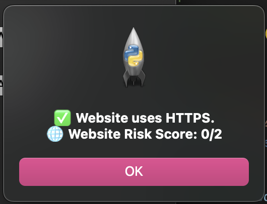
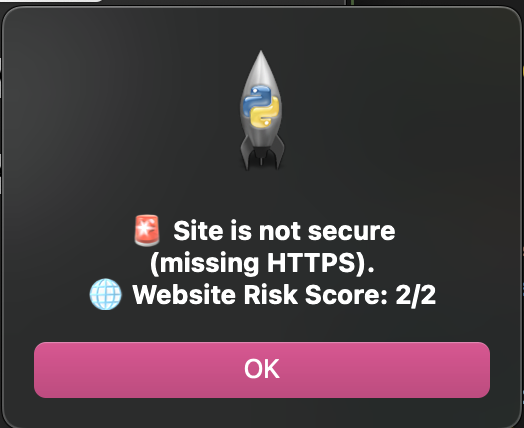
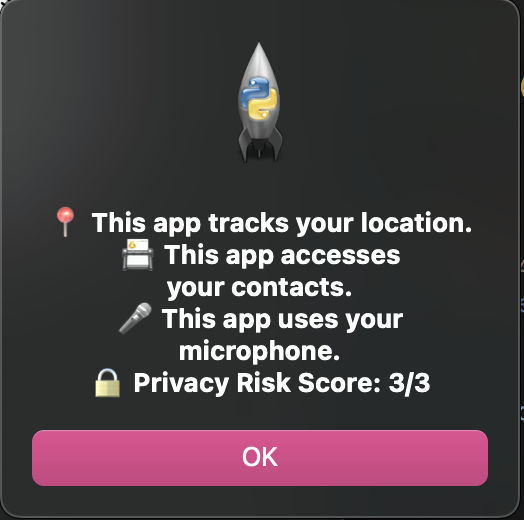

# Digital Privacy Risk Scanner - Final Project

For my final project, I created a simple tool that helps users assess the digital privacy risks of passwords, websites, and mobile apps. It provides a privacy risk score and feedback based on user input, aiming to promote awareness and education around common digital vulnerabilities.

This is meant to be a prototype tool built for educational purposes as part of my thesis on digital vulnerability, privacy, and community empowerment.

## Features of this project:
- Password Strength Analyzer
- Website HTTPS Security Checker
- Mobile App Privacy Scanner (based on the default permissions)
- Linked my full thesis toolkit for more learning! - Digital Privacy Toolkit (Understanding Your Digital Self)

I wanted to emphaszie that there is no data storage or network connection to use this — all analysis is done locally on your device

## How It Works:
- Password Check: Flags short, common, or weak passwords and suggests improvements.

- Website Check: Verifies if a URL uses HTTPS for secure connections.

- App Scanner: Looks up known apps and highlights default permissions (like location, contacts, microphone).

- Privacy Toolkit: Opens a link to a full educational toolkit on digital privacy and protection.

## Code:
- [Code](main.py)
- Used Tkinter for the GUI
- Used Webbrowser for linking to toolkit

